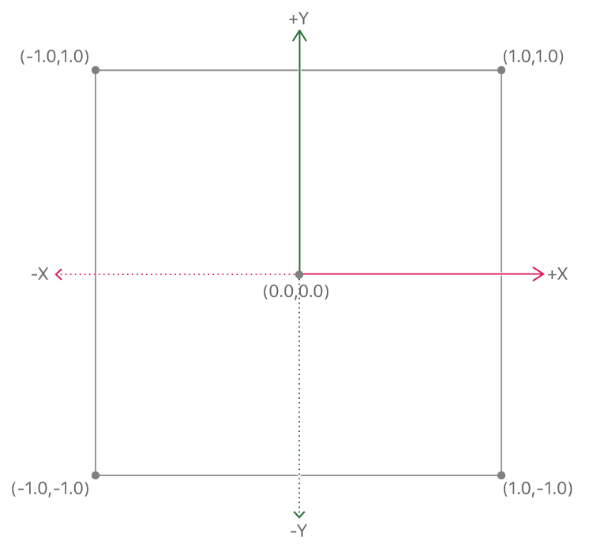

# Hello Triangle

Demonstrates how to render a simple 2D triangle.

## Overview

In the [Devices and Commands](https://developer.apple.com/documentation/metal/devices_and_commands) sample, you learned how to write an app that uses Metal and issues basic rendering commands to the GPU.

In this sample, you'll learn how to render basic geometry in Metal. In particular, you'll learn how to work with vertex data and SIMD types, configure the graphics rendering pipeline, write GPU functions, and issue draw calls.

## The Metal Graphics Rendering Pipeline

The Metal graphics rendering pipeline is made up of multiple graphics processing unit (GPU) stages, some programmable and some fixed, that execute a draw command. Metal defines the inputs, processes, and outputs of the pipeline as a set of rendering commands applied to certain data. In its most basic form, the pipeline receives vertices as input and renders pixels as output. This sample focuses on the three main stages of the pipeline: the vertex function, the rasterization stage, and the fragment function. The vertex function and fragment function are programmable stages. The rasterization stage is fixed.


A `MTLRenderPipelineState` object represents a graphics-rendering pipeline. Many stages of this pipeline can be configured using a `MTLRenderPipelineDescriptor` object, which defines a large portion of how Metal processes input vertices into rendered output pixels.

## Vertex Data

A vertex is simply a point in space where two or more lines meet. Typically, vertices are expressed as a collection of Cartesian coordinates that define specific geometry, along with optional data associated with each coordinate.

This sample renders a simple 2D triangle made up of three vertices, with each vertex containing the position and color of a triangle corner.


Position is a required vertex attribute, whereas color is optional. For this sample, the pipeline uses both vertex attributes to render a colored triangle onto a specific region of a drawable.

## Use SIMD Data Types

Vertex data is usually loaded from a file that contains 3D model data exported from specialized modeling software. Detailed models may contain thousands of vertices with many attributes, but ultimately they all end up in some form of array that is specially packaged, encoded, and sent to the GPU.

The sample's triangle defines a 2D position (x, y) and RGBA color (red, green, blue, alpha) for each of its three vertices. This relatively small amount of data is directly hard coded into an array of structures, where each element of the array represents a single vertex. The structure used as the data type for the array elements defines the memory layout of each vertex.

Vertex data, and 3D graphics data in general, is usually defined with vector data types, simplifying common graphics algorithms and GPU processing. This sample uses optimized vector data types provided by the SIMD library to represent the triangle's vertices. The SIMD library is independent from Metal and MetalKit, but is highly recommended for developing Metal apps, mainly for its convenience and performance benefits.

The triangle's 2D position components are jointly represented with a `vector_float2` SIMD data type, which holds two 32-bit floating-point values. Similarly, the triangle's RGBA color components are jointly represented with a `vector_float4` SIMD data type, which holds four 32-bit floating-point values. Both of these attributes are then combined into a single `AAPLVertex` structure.

``` objective-c
typedef struct
{
    // Positions in pixel space (i.e. a value of 100 indicates 100 pixels from the origin/center)
    vector_float2 position;

    // Floating point RGBA colors
    vector_float4 color;
} AAPLVertex;
```

The triangle's three vertices are directly hard coded into an array of `AAPLVertex` elements, thus defining the exact attribute values of each vertex.

``` objective-c
static const AAPLVertex triangleVertices[] =
{
    // 2D Positions,    RGBA colors
    { {  250,  -250 }, { 1, 0, 0, 1 } },
    { { -250,  -250 }, { 0, 1, 0, 1 } },
    { {    0,   250 }, { 0, 0, 1, 1 } },
};
```

## Set a Viewport

A viewport specifies the area of a drawable that Metal renders content to. A viewport is a 3D area with an x and y offset, a width and height, and near and far planes (although these last two aren't needed here because this sample renders 2D content only).

Assigning a custom viewport for the pipeline requires encoding a `MTLViewport` structure into a render command encoder by calling the `setViewport:` method. If a viewport isn't specified, Metal sets a default viewport with the same size as the drawable used to create the render command encoder.

## Write a Vertex Function

The main task of a vertex function (also known as a *vertex shader*) is to process incoming vertex data and map each vertex to a position in the viewport. This way, subsequent stages in the pipeline can refer to this viewport position and render pixels to an exact location in the drawable. The vertex function accomplishes this task by translating arbitrary vertex coordinates into normalized device coordinates, also known as *clip-space coordinates*.

Clip space is a 2D coordinate system that maps the viewport area to a [-1.0, 1.0] range along both the x and y axes. The viewport's lower-left corner is mapped to (-1.0, -1.0), the upper-right corner is mapped to (1.0, 1.0), and the center is mapped to (0.0, 0.0).



A vertex function executes once for each vertex drawn. In this sample, for each frame, three vertices are drawn to make up a triangle. Thus, the vertex function executes three times per frame.

Vertex functions are written in the Metal shading language, which is based on C++ 14. Metal shading language code may seem similar to traditional C/C++ code, but the two are fundamentally different. Traditional C/C++ code is typically executed on the CPU, whereas Metal shading language code is exclusively executed on the GPU. The GPU offers much larger processing bandwidth and can work, in parallel, on a larger number of vertices and fragments.  However, it has less memory than a CPU, does not handle control flow operations as efficiently, and generally has higher latency.

The vertex function in this sample is called `vertexShader` and this is its signature.

``` metal
vertex RasterizerData
vertexShader(uint vertexID [[vertex_id]],
             constant AAPLVertex *vertices [[buffer(AAPLVertexInputIndexVertices)]],
             constant vector_uint2 *viewportSizePointer [[buffer(AAPLVertexInputIndexViewportSize)]])
```

**Declare Vertex Function Parameters**

The first parameter, `vertexID`, uses the `[[vertex_id]]` attribute qualifier and holds the index of the vertex currently being executed. When a draw call uses this vertex function, this value begins at 0 and is incremented for each invocation of the `vertexShader` function. A parameter using the `[[vertex_id]]` attribute qualifier is typically used to index into an array that contains vertices.

The second parameter, `vertices`, is the array that contains vertices, with each vertex defined as an `AAPLVertex` data type. A pointer to this structure defines an array of these vertices.

The third and final parameter, `viewportSizePointer`, contains the size of the viewport and has a `vector_uint2` data type.

Both the `vertices` and `viewportSizePointer` parameters use SIMD data types, which are types understood by both C and Metal shading language code. The sample can thus define the `AAPLVertex` structure in the shared `AAPLShaderTypes.h` header, included in both the `AAPLRenderer.m` and `AAPLShaders.metal` code. Therefore, the shared header ensures that the data type of the triangle's vertices is the same in the Objective-C declaration (`triangleVertices`) as it is in the Metal shading language declaration (`vertices`). Using SIMD data types in your Metal app ensures that memory layouts match exactly across CPU/GPU declarations and facilitates sending vertex data from the CPU to the GPU.

- Note: Any changes to the `AAPLVertex` structure affect both the `AAPLRenderer.m` and `AAPLShaders.metal` code equally.

Both the `vertices` and `viewportSizePointer` parameters use the `[[buffer(index)]]` attribute qualifier. The values of `AAPLVertexInputIndexVertices` and `AAPLVertexInputIndexViewportSize` are the indices used to identify and set the inputs to the vertex function in both the `AAPLRenderer.m` and `AAPLShaders.metal` code.

**Declare Vertex Function Return Values**

The `RasterizerData` structure defines the return value of the vertex function.

``` metal
typedef struct
{
    // The [[position]] attribute qualifier of this member indicates this value is the clip space
    //   position of the vertex when this structure is returned from the vertex function
    float4 clipSpacePosition [[position]];

    // Since this member does not have a special attribute qualifier, the rasterizer will
    //   interpolate its value with values of other vertices making up the triangle and
    //   pass that interpolated value to the fragment shader for each fragment in that triangle
    float4 color;

} RasterizerData;
```

Vertex functions must return a clip-space position value for each vertex via the `[[position]]` attribute qualifier, which the `clipSpacePosition` member uses. When this attribute is declared, the next stage of the pipeline, rasterization, uses the `clipSpacePosition` values to identify the position of the triangle's corners and determine which pixels to render.

**Process Vertex Data**

The body of the sample's vertex function does two things to the input vertices:
1. Performs coordinate-system transformations, writing the resulting vertex clip-space position to the `out.clipSpacePosition` return value.
2. Passes the vertex color to the `out.color` return value.

To get an input vertex, the `vertexID` parameter is used to index into the `vertices` array.

``` metal
float2 pixelSpacePosition = vertices[vertexID].position.xy;
```

This sample obtains a 2D vertex coordinate from the `position` member of each `vertices` element and converts it into a clip-space position written to the `out.clipSpacePosition` return value. Each vertex input position is defined relative to the number of pixels in the x and y directions from the center of the viewport. Thus, to convert these pixel-space positions to clip-space positions, the vertex function divides by half the viewport size.

``` metal
out.clipSpacePosition.xy = pixelSpacePosition / (viewportSize / 2.0);
```

Finally, the vertex function accesses the `color` member of each `vertices` element and passes it along to the `out.color` return value, without performing any modifications.

``` metal
out.color = vertices[vertexID].color;
```

The contents of the `RasterizerData` return value are now complete, and the structure is passed along to the next stage in the pipeline.

## Rasterization

After the vertex function executes three times, once for each of the triangle's vertices, the next stage in the pipeline, rasterization, begins.

Rasterization is the stage in which the pipeline's rasterizer unit produces fragments. A fragment contains raw prepixel data that's used to produce the pixels rendered to a drawable. For each complete triangle produced by the vertex function, the rasterizer determines which pixels of the destination drawable are covered by the triangle. It does so by testing whether the center of each pixel in the drawable is the inside the triangle. In the following diagram, only fragments whose pixel center is inside the triangle are produced. These fragments are shown as gray squares.


Rasterization also determines the values that are sent to the next stage in the pipeline: the fragment function. Earlier in the pipeline, the vertex function output the values of a `RasterizerData` structure, which contains a clip-space position (`clipSpacePosition`) and a color (`color`). The `clipSpacePosition` member uses the required `[[position]]` attribute qualifier, indicating that these values are directly used to determine the triangle's fragment coverage area. The `color` member doesn't have an attribute qualifier, indicating that these values should be interpolated across the triangle's fragments.

The rasterizer passes `color` values to the fragment function after converting them from per-vertex values to per-fragment values. This conversion uses a fixed interpolation function, which calculates a single weighted color derived from the `color` values of the triangle's three vertices. The weights for the interpolation function (also known as *barycentric coordinates*.) are the relative distances of each vertex position to the center of a fragment. For example:

* If a fragment is exactly in the middle of a triangle, equidistant from each of the triangle's three vertices, the color of each vertex is weighted by 1/3. In the following diagram, this is shown as the gray fragment (0.33, 0.33, 0.33) in the center of the triangle.

* If a fragment is very close to one vertex and very far from the other two, the color of the close vertex is weighted toward 1 and the color of the far ones is weighted toward 0. In the following diagram, this is shown as the reddish fragment (0.5, 0.25, 0.25) near the bottom-right corner of the triangle.

* If a fragment is on an edge of the triangle, midway between two of the three vertices, the color of each edge-defining vertex is weighted by 1/2 and the color of the nonedge vertex is weighted by 0. In the following diagram, this is shown as the cyan fragment (0.0, 0.5, 0.5) on the left edge of the triangle.


Because rasterization is a fixed pipeline stage, its behavior can't be modified by custom Metal shading language code. After the rasterizer creates a fragment, along with its associated values, the results are passed along to the next stage in the pipeline.

## Write a Fragment Function

The main task of a fragment function (also known as *fragment shader*) is to process incoming fragment data and calculate a color value for the drawable's pixels.

The fragment function in this sample is called `fragmentShader` and this is its signature.

``` metal
fragment float4 fragmentShader(RasterizerData in [[stage_in]])
```

The function has a single parameter, `in`, that uses the same `RasterizerData` structure returned by the vertex function.  The `[[stage_in]]` attribute qualifier indicates that this parameter comes from the rasterizer. The function returns a four-component floating-point vector, which contains the final RGBA color value to be rendered to the drawable.

This sample demonstrates a very simple fragment function that returns the interpolated `color` value from the rasterizer, without further processing. Each fragment renders its interpolated `color` value to its corresponding pixel in the triangle.

``` metal
return in.color;
```

## Obtain Function Libraries and Create a Pipeline

When building the sample, Xcode compiles the `AAPLShaders.metal` file along with the Objective-C code.  However, Xcode can't link the `vertexShader` and `fragmentShader` functions at build time; instead, the app needs to explicitly link these functions at runtime.

Metal shading language code is compiled in two stages:

1. Front-end compilation happens in Xcode at build time. `.metal` files are compiled from high-level source code into intermediate representation (IR) files.
2. Back-end compilation happens in a physical device at runtime. IR files are then compiled into low-level machine code.


Each GPU family has a different instruction set. As a result, Metal shading language code can only be fully compiled into native GPU code at runtime, by the physical device itself. Front-end compilation reduces some of this compilation overhead by storing IR in a `default.metallib` file that's packaged inside the sample's `.app` bundle.

The `default.metallib` file is a library of Metal shading language functions that's represented by a `MTLLibrary` object retrieved at runtime by calling the `newDefaultLibrary` method. From this library, specific functions represented by `MTLFunction` objects can be retrieved.

``` objective-c
// Load all the shader files with a metal file extension in the project
id<MTLLibrary> defaultLibrary = [_device newDefaultLibrary];

// Load the vertex function from the library
id<MTLFunction> vertexFunction = [defaultLibrary newFunctionWithName:@"vertexShader"];

// Load the fragment function from the library
id<MTLFunction> fragmentFunction = [defaultLibrary newFunctionWithName:@"fragmentShader"];
```

These `MTLFunction` objects are used to create a `MTLRenderStatePipeline` object that represents the graphics-rendering pipeline. Calling the  `newRenderPipelineStateWithDescriptor:error:` method of a `MTLDevice` object begins the back-end compilation process that links the `vertexShader` and `fragmentShader` functions, resulting in a fully compiled pipeline.

A `MTLRenderStatePipeline` object contains additional pipeline settings that are configured by a `MTLRenderPipelineDescriptor` object. Besides the vertex and fragment functions, this sample also configures the `pixelFormat` value of the first entry in the `colorAttachments` array. This sample only renders to a single target, the view's drawable (`colorAttachments[0]`), whose pixel format is configured by the view itself (`colorPixelFormat`). A view's pixel format defines the memory layout of each of its pixels; Metal must be able to reference this layout when creating the pipeline so that it can properly render the color values produced by the fragment function.

``` objective-c
MTLRenderPipelineDescriptor *pipelineStateDescriptor = [[MTLRenderPipelineDescriptor alloc] init];
pipelineStateDescriptor.label = @"Simple Pipeline";
pipelineStateDescriptor.vertexFunction = vertexFunction;
pipelineStateDescriptor.fragmentFunction = fragmentFunction;
pipelineStateDescriptor.colorAttachments[0].pixelFormat = mtkView.colorPixelFormat;

_pipelineState = [_device newRenderPipelineStateWithDescriptor:pipelineStateDescriptor
                                                         error:&error];
```

## Send Vertex Data to a Vertex Function

After the pipeline is created, it can be assigned to a render command encoder. This operation that all subsequent rendering commands will be processed by that specific pipeline.

``` objective-c
[renderEncoder setRenderPipelineState:_pipelineState];
```

This sample uses the `setVertexBytes:length:atIndex:` method to send vertex data to a vertex function. As mentioned earlier, the signature of the sample's `vertexShader` function has two parameters, `vertices` and `viewportSizePointer`, that use the `[[buffer(index)]]` attribute qualifier. The value of the `index` parameter in the `setVertexBytes:length:atIndex:` method maps to the parameter with the same `index` value in the `[[buffer(index)]]` attribute qualifier. Thus, calling the `setVertexBytes:length:atIndex:` method sets specific vertex data for a specific vertex function parameter.

The `AAPLVertexInputIndexVertices` and `AAPLVertexInputIndexViewportSize` values are defined in the `AAPLShaderTypes.h` header shared between the `AAPLRenderer.m` and `AAPLShaders.metal` files. The sample uses these values for the `index` parameter of both the `setVertexBytes:length:atIndex:` method and the `[[buffer(index)]]` attribute qualifier corresponding to the same vertex function. Sharing these values across different files makes the sample more robust by reducing potential index mismatches due to hard-coded integers (which could send the wrong data to the wrong parameter).

This sample sends the following vertex data to a vertex function:
* The `triangleVertices` pointer is sent to the `vertices` parameter, using the `AAPLVertexInputIndexVertices` index value
* The `_viewportSize` pointer is sent to `viewportSizePointer` parameter, using the `AAPLVertexInputIndexViewportSize` index value

``` objective-c
// Here we're sending a pointer to our 'triangleVertices' array (and indicating its size).
//   The AAPLVertexInputIndexVertices enum value corresponds to the 'vertexArray' argument
//   in our 'vertexShader' function because its buffer attribute qualifier also uses
//   AAPLVertexInputIndexVertices for its index
[renderEncoder setVertexBytes:triangleVertices
                       length:sizeof(triangleVertices)
                      atIndex:AAPLVertexInputIndexVertices];

// Here we're sending a pointer to '_viewportSize' and also indicate its size so the whole
//   think is passed into the shader.  The AAPLVertexInputIndexViewportSize enum value
///  corresponds to the 'viewportSizePointer' argument in our 'vertexShader' function
//   because its buffer attribute qualifier also uses AAPLVertexInputIndexViewportSize
//   for its index
[renderEncoder setVertexBytes:&_viewportSize
                       length:sizeof(_viewportSize)
                      atIndex:AAPLVertexInputIndexViewportSize];
```

## Draw the Triangle

After setting a pipeline and its associated vertex data, issuing a draw call executes the pipeline and draws the sample's single triangle. The sample encodes a single drawing command into the render command encoder.

Triangles are geometric primitives in Metal that require three vertices to be drawn. Other primitives include lines that require two vertices, or points that require just one vertex. The `drawPrimitives:vertexStart:vertexCount:` method lets you specify exactly what type of primitive to draw and which vertices, derived from the previously set vertex data, to use. Setting 0 for the `vertexStart` parameter indicates that drawing should begin with the first vertex in the array of vertices. This means that the first value of the vertex function's `vertexID` parameter, which uses the `[[vertex_id]]` attribute qualifier, will be 0. Setting 3 for the `vertexCount` parameter indicates that three vertices should be drawn, producing a single triangle. (That is, the vertex function is executed three times with values of 0, 1, and 2 for the `vertexID` parameter).

``` objective-c
// Draw the 3 vertices of our triangle
[renderEncoder drawPrimitives:MTLPrimitiveTypeTriangle
                  vertexStart:0
                  vertexCount:3];
```

This call is the last call needed to encode the rendering commands for a single triangle. With the drawing complete, the render loop can end encoding, commit the command buffer, and present the drawable containing the rendered triangle.

## Next Steps

In this sample, you learned how to render basic geometry in Metal.

In the [Basic Buffers](https://developer.apple.com/documentation/metal/fundamental_lessons/basic_buffers) sample, you'll learn how to use a vertex buffer to improve your rendering efficiency.
