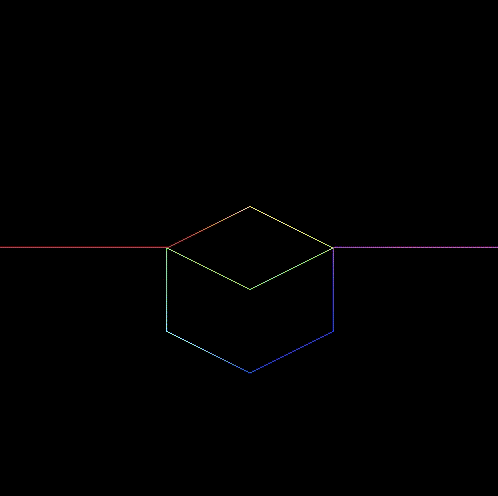
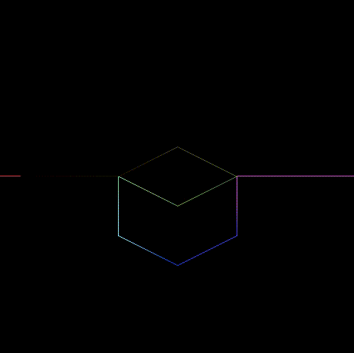
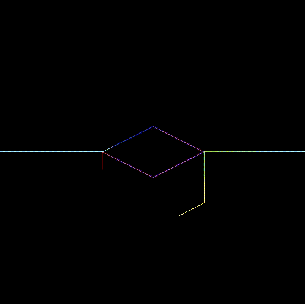

# Color Gradient Animation on a path

Performs animated color gradient on a path, using Metal vertex / fragment shader. It is based on [Apple's Metal example code](https://developer.apple.com/documentation/metal/using_a_render_pipeline_to_render_primitives?language=objc)


Try different values of the following variable for slightly different animations
``` objective-c
    const BONAnimationType animation = BONAnimationTypeDecreasingDiscreteBrightness;
```





