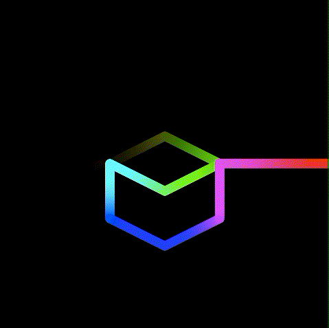

# Experiment: Color Gradient Animation on a path 

Performs animated color gradient on a path (made of lines), using Metal fragment shader. It is based on [Apple's Metal example code](https://developer.apple.com/documentation/metal/using_a_render_pipeline_to_render_primitives?language=objc)

